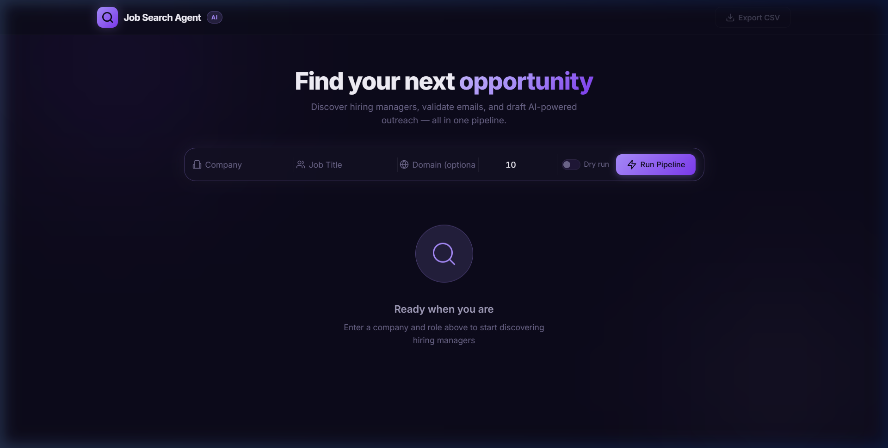

<p align="center">
  <h1 align="center">🎯 AI-Powered Job Search Outreach Agent</h1>
  <p align="center">
    <em>Automate your job search — find hiring managers, validate emails, and draft personalized outreach at scale.</em>
  </p>
  <p align="center">
    
    
    
    
  </p>
</p>

---

## 📌 What Is This?

A fully automated **cold-outreach pipeline** designed for job seekers. Give it a company name and a job title, and it will:

1. **🔍 Find** real hiring managers on LinkedIn via Google Search (with DuckDuckGo fallback)
2. **🤖 Verify** candidates using LLM-based relevance filtering (NVIDIA Devstral)
3. **📧 Validate** their corporate email addresses through DNS MX lookups & SMTP probing
4. **✍️ Draft** personalized cold emails powered by AI — tailored to the recipient's role
5. **📊 Export** everything to a clean, structured CSV ready for your outreach workflow

> **No emails are ever sent.** This tool only finds, validates, and prepares — you stay in full control of what gets sent.

---

## 🏗️ Architecture

```
┌──────────────────────────────────────────────────────────────────┐
│                         main.py                                  │
│                    (Orchestrator / CLI)                           │
│                                                                  │
│  Step 1          Step 2              Step 3          Step 4      │
│  ┌──────────┐   ┌────────────────┐   ┌────────────┐  ┌────────┐ │
│  │ Target   │──▶│ Email          │──▶│ Email      │─▶│ Data   │ │
│  │ Finder   │   │ Validator      │   │ Drafter    │  │ Export │ │
│  └──────────┘   └────────────────┘   └────────────┘  └────────┘ │
└──────────────────────────────────────────────────────────────────┘
       │                  │                   │              │
       ▼                  ▼                   ▼              ▼
  Google Search      DNS MX Lookup      NVIDIA NIM API    CSV File
  + DuckDuckGo       SMTP RCPT TO       (Devstral LLM)
  + LLM Verify       Catch-All Check
```

| File | Purpose |
|---|---|
| `main.py` | CLI entry point & pipeline orchestrator |
| `config.py` | Environment variables, constants, and your tech profile |
| `target_finder.py` | LinkedIn profile discovery via web search + LLM verification |
| `email_validator.py` | Email permutation generator + DNS/SMTP validation |
| `email_drafter.py` | Personalized cold email drafting via NVIDIA Devstral |
| `data_export.py` | CSV writer with Excel-compatible encoding |

---

## 🎨 Web Dashboard

The project now includes a beautiful, modern web dashboard for running the pipeline interactively:



---

## ⚡ Quick Start

### Prerequisites

- **Python 3.10+**
- **NVIDIA API Key** — [Get one free from NVIDIA Build](https://build.nvidia.com/)

### 1. Clone & Install

```bash
git clone <your-repo-url>
cd "Job Search Agent"

# Create virtual environment
python -m venv .venv

# Activate it
# Windows:
.venv\Scripts\activate
# macOS / Linux:
source .venv/bin/activate

# Install dependencies
pip install -r requirements.txt
```

### 2. Configure Environment

```bash
cp .env.example .env
```

Open `.env` and add your API key:

```env
NVIDIA_API_KEY=nvapi-your_key_here
```

<details>
<summary><strong>📋 Full list of environment variables</strong></summary>

| Variable | Required | Default | Description |
|---|:---:|---|---|
| `NVIDIA_API_KEY` | ✅ | — | Your NVIDIA NIM API key |
| `NVIDIA_MODEL` | | `mistralai/devstral-2-123b-instruct-2512` | LLM model for email drafting & verification |
| `NVIDIA_BASE_URL` | | `https://integrate.api.nvidia.com/v1` | NVIDIA NIM API endpoint |
| `NVIDIA_TEMPERATURE` | | `0.7` | LLM response creativity (0.0–1.0) |
| `NVIDIA_MAX_TOKENS` | | `1024` | Max tokens per LLM response |
| `SMTP_FROM_ADDRESS` | | `probe@yourdomain.com` | Address used in `MAIL FROM` probe |
| `SMTP_TIMEOUT` | | `10` | Seconds before SMTP probe times out |
| `REQUEST_TIMEOUT` | | `15` | HTTP request timeout for web searches |
| `MAX_SEARCH_RESULTS` | | `10` | Maximum LinkedIn profiles to return |
| `OUTPUT_CSV` | | `outreach_results.csv` | Output file path |

</details>

### 3. Run the Pipeline

#### Option A: Web UI (Recommended)

```bash
python server.py
# Open http://localhost:8000 in your browser
```

The web interface provides a modern, dark-themed dashboard with a sleek violet/purple aesthetic:
- **Real-time pipeline progress** — watch each step complete with live status updates
- **Results cards** — browse discovered profiles, validated emails, and LinkedIn links in a responsive grid layout
- **Email preview** — click to view AI-drafted emails in a slide-over panel with copy-to-clipboard support
- **CSV download** — export results directly from the browser

#### Option B: CLI

```bash
# Interactive mode — you'll be prompted for company, title, and domain
python main.py

# CLI mode — pass arguments directly
python main.py --company "Google" --title "Engineering Manager" --domain "google.com"

# Short flags
python main.py -c Stripe -t "Head of Engineering" -d stripe.com

# Dry-run — test search only, skip validation & drafting
python main.py --company "Google" --title "Engineering Manager" --dry-run

# Verbose logging — see detailed debug output
python main.py -c Stripe -t "Head of Engineering" -d stripe.com -v
```

### 4. View Results

Results are saved to `outreach_results.csv` with the following columns:

| Column | Description |
|---|---|
| `full_name` | Target's full name |
| `first_name` | First name |
| `last_name` | Last name |
| `job_title` | Role/position at the company |
| `company` | Company name |
| `domain` | Corporate email domain |
| `profile_url` | LinkedIn profile URL |
| `validated_email` | Validated (or best-guess) email address |
| `email_body` | AI-drafted personalized cold outreach email |

---

## 🔧 How Each Module Works

### 🔍 Target Finder (`target_finder.py`)

Discovers LinkedIn profiles matching your search criteria using a dual-search strategy:

- **Google Search** (primary) — more accurate results via `googlesearch-python`
- **DuckDuckGo** (fallback) — used when Google is unavailable, via `duckduckgo_search`
- **LLM Verification** — sends candidate profiles to NVIDIA Devstral to verify they actually hold the specified job title at the target company
- **Smart Filtering** — deduplication, company-name matching, credential stripping, and name validation

### 📧 Email Validator (`email_validator.py`)

Generates and validates corporate email addresses without ever sending a message:

1. **Permutation Generation** — creates 10 common corporate email formats (e.g., `first.last@`, `flast@`, `first@`, etc.)
2. **DNS MX Lookup** — resolves the domain's mail exchange servers
3. **SMTP `RCPT TO` Probe** — connects to the primary MX server, issues `HELO`/`MAIL FROM`/`RCPT TO`, and reads the response code. **No email is ever sent.**
4. **Catch-All Detection** — probes a random fake address first; if accepted, marks all `250` responses as `CATCH_ALL` to avoid false positives

### ✍️ Email Drafter (`email_drafter.py`)

Generates personalized cold outreach emails via NVIDIA's Devstral LLM:

- **Strict Formatting** — exactly 3 paragraphs, under 180 words, with subject line on line 1
- **Skills Mapping** — maps your technical skills to the target company's likely pain points
- **No Generic Fluff** — the system prompt enforces specificity and relevance
- **Retry Logic** — exponential backoff with jitter on rate limits

### 📊 Data Export (`data_export.py`)

- Writes results to a UTF-8 BOM encoded CSV (opens correctly in Excel)
- Uses `csv.QUOTE_ALL` to prevent delimiter-in-data issues
- Overwrites on each run to keep results fresh

---

## 🎨 Customizing Your Tech Profile

The LLM uses your tech profile to craft personalized emails. Edit `TECH_SKILLS` in `config.py`, or override via `.env`:

```bash
TECH_SKILLS='{
  "languages": ["Python", "Go", "Rust"],
  "frameworks": ["Django", "gRPC", "FastAPI"],
  "domains": ["distributed systems", "ML pipelines", "cloud infrastructure"],
  "highlights": [
    "Scaled API from 1k to 50k RPS",
    "Led migration to Kubernetes across 200+ services",
    "Built real-time fraud detection pipeline processing 10M events/day"
  ]
}'
```

---

## 🛡️ Error Handling

The pipeline is designed to be resilient — individual failures never crash the entire run:

| Scenario | What Happens |
|---|---|
| Google Search blocked / CAPTCHA | Falls back to DuckDuckGo automatically |
| HTTP 429 / 503 rate limit | Exponential backoff with jitter, retries up to N times |
| No matching LinkedIn profiles | Logs a warning; pipeline exits cleanly |
| Name looks like a job title | Profile is skipped to prevent false positives |
| No MX records for domain | Email candidates marked `UNKNOWN`; best-guess fallback used |
| SMTP timeout / connection refused | Individual candidate marked `UNKNOWN`; pipeline continues |
| NVIDIA API rate limit | Exponential backoff; raises `RuntimeError` after exhausting retries |
| Empty / invalid LLM response | Retried up to `max_retries` times |

---

## 📁 Project Structure

```
Job Search Agent/
├── .env.example          # Template for environment variables
├── .env                  # Your local config (git-ignored)
├── .gitignore
├── requirements.txt      # Python dependencies
├── README.md
│
├── main.py               # CLI entry point & pipeline orchestrator
├── server.py             # FastAPI web server with SSE streaming
├── config.py             # Configuration & environment loader
├── target_finder.py      # LinkedIn profile discovery
├── email_validator.py    # Email permutation & SMTP validation
├── email_drafter.py      # AI-powered email drafting
├── data_export.py        # CSV export
│
├── frontend/
│   ├── index.html        # Web UI — main page
│   ├── app.js            # Client-side logic (SSE, rendering)
│   └── styles.css        # Dark theme with glassmorphism
│
└── outreach_results.csv  # Output (generated after first run)
```

---

## 📦 Dependencies

| Package | Purpose |
|---|---|
| `googlesearch-python` | Google Search scraping for LinkedIn profile discovery |
| `ddgs` | DuckDuckGo search (fallback engine) |
| `dnspython` | DNS MX record resolution |
| `openai` | NVIDIA NIM API client (OpenAI-compatible) |
| `python-dotenv` | Environment variable loading from `.env` |
| `fastapi` | Web server framework for the browser-based UI |
| `uvicorn` | ASGI server to run the FastAPI application |

---

## ⚖️ Legal & Ethical Notes

> [!IMPORTANT]
> This tool is intended for **personal job-search assistance** only.

- **No emails are sent** — the SMTP probe only issues `RCPT TO` and disconnects immediately
- **Scraping LinkedIn** search results via a search engine is subject to their Terms of Service — use responsibly and at low volume
- **Comply with CAN-SPAM / GDPR** when actually sending outreach emails through your own email client
- **Rate limiting is built in** — the tool includes delays and backoff to be respectful to external services

---

## 🤝 Contributing

Contributions are welcome! Feel free to open an issue or submit a pull request. Some ideas:

- Add support for additional search engines
- Extend email validation with Hunter.io or similar API integrations
- Build a web UI for non-technical users
- Add support for bulk company lists

---

## 📄 License

This project is open source and available under the [MIT License](LICENSE).
